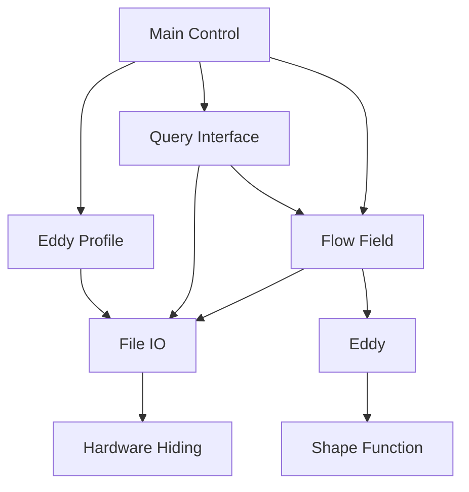

# Poster Presentation
Nov. 6, 2024

## Modules graph

```mermaid
graph TD
    A[Main Control] --> B[Query Interface]
    B[Query Interface] --> D[Flow Field]
    A[Main Control] --> D[Flow Field]
    A[Main Control] --> C[Eddy Profile]
    C[Eddy Profile] --> E[File IO]
    B[Query Interface] --> E[File IO]
    D[Flow Field] --> E[File IO]
    D[Flow Field] --> G[Eddy]
    E[File IO] --> F[Hardware Hiding]
    G[Eddy] --> H[Shape Function]
```