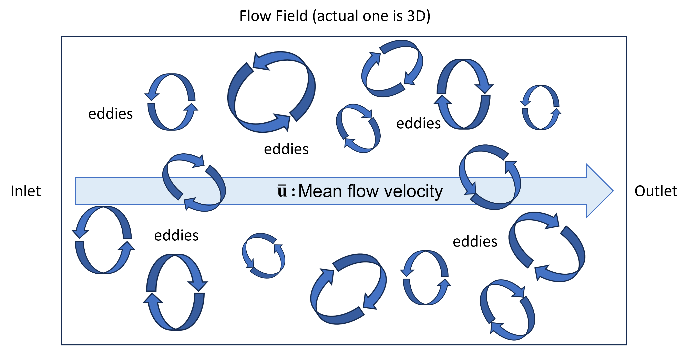

# Summary

Turbulent flow is a type of fluid motion characterized by chaotic fluctuations in velocity and pressure.
Today, most turbulent flow simulations with Computational Fluid Dynamics (CFD) are based on simplified models such as Reynolds-Averaged Navier-Stokes (RANS) equations.
While other approaches can reveal more details in the flow, such as Large Eddy Simulation (LES) and Direct Numerical Simulation (DNS), they are often deemed too computationally expensive and thus see limited use in practice.
`SynthEddy` is a Python program that aims to alleviate part of this issue by generating Initial Conditions (IC) and Boundary Conditions (BC) for LES using the Synthetic Eddy Method.
`SynthEddy` has the potential to reduce the required simulation scale both in time and space, making LES more accessible to a wider audience.

# Statement of need

Compared to widely used RANS models in CFD, LES can capture more intricate details of a turbulent flow, down to individual eddies.
This can be desirable in many applications or scenarios, such as gas turbine design, airfoil flow separation, construction airflow, ocean studies, and more [@Kim:1999; @You:2008; @VanMaele:2008; @Chamecki:2019].
However, the adoption of LES has been largely limited by its computational cost, which can be orders of magnitude higher than RANS [@Yang:2015]. 
Not only the model itself is more computationally expensive, but there exists a compounding issue with the initiation of the simulation.

Unlike RANS that can be described by a few parameters, to utilize LES in any practical manner, there must already exist a realistic enough turbulent flow field running in the simulation.
To reach such a state, either prior simulations with longer time and larger field for the turbulent flow to develop are needed (more expensive), or a suitable inlet condition must be synthesized.
@Poletto:2013 proposed one such method by generating synthetic eddies to mimic a turbulent flow.
Compared to previous proposals, such as random fluctuations, this method is divergence free and closer to the actual turbulent flow.

`SynthEddy` is an implementation of this method in Python, combined with recent work by Holyev in this topic. [@Holyev:2024]
It models turbulent flow fields consisting of synthetic eddies of various sizes, orientations and intensities, flowing from inlet to outlet with a uniform or non-uniform mean velocity.
This physical system is shown in \autoref{fig:PS}.
The user can generate turbulent flow and query the velocity field to be used in both turbulent research and as IC/BC for CFD simulations.

# Features and usage
- Generate synthetic turbulent flow field consisting of eddies.  
  Users need to provide an eddy profile with the following parameters of each type of eddy to be included in the field:
    - Size (length-scale)
    - Density (number of eddies per unit volume)
    - Intensity magnitude  
- Query velocity vectors in the generated field as a meshgrid, which can be:
    - The whole field.
    - Any subsection of the field.
    - At any point in time after generation.

A quick start guide is provided in the [README.md](https://github.com/omltcat/turbulent-flow?tab=readme-ov-file#quick-start) of the repository.

The generated field is fully wrapped around on all boundaries, ensuring conservation of mass. Details on how wrapped around is handled in different flow scenarios can be found in the [Module Guide (MG)](https://github.com/omltcat/turbulent-flow/blob/main/docs/Design/SoftArchitecture/MG.pdf) (see Field Wrap-around section).

The query result is saved as a NumPy array (`.npy` file) representing velocity vectors in a 3D meshgrid, with a shape of `(Nx, Ny, Nz, 3)` where `N` is the number of grid points in each direction, and the last dimension represents $x$, $y$, and $z$ components of the velocity vector.

A velocity magnitude cross-section plot example from a $1000^3$ meshgrid is shown in \autoref{fig:result}.

## Customization
`SynthEddy` allows the user to easily program certain aspects of the generated field to better suit their specific needs. This includes:
- Non-uniform mean velocity distribution.  
  Instead of inputting a constant mean velocity across the field, the user can provide a function to obtain mean $x$-velocity ($\overline{\mathbf{u}}$) based on $y$- and $z$-coordinates. This is useful for simulation of channel flows and boundary layers.
- Eddy shape function.
  A function that describes the velocity distribution of individual eddies.

  Detailed explanation on editing these functions can be found in the [README.md](https://github.com/omltcat/turbulent-flow/blob/main/README.md#customization).

## Typical use case
- Whole field (IC and research)  
  To initiate a CFD simulation, the user can generate a field and query its entirety at $t=0$ to obtain the initial condition. This use case can also be used in turbulent research, such as turbulent energy spectrum analysis. Depending on the size of the field and query meshgrid resolution, this can take significant time and memory.
- Salami slicing (BC)  
  In a continuously running CFD simulation, the user can keep querying a thin subsection of the field with advancing time, and feed the results as inlet boundary conditions to the simulation. Since the region is much smaller than the whole field, this can be done significantly faster.  
  `SynthEddy` allows querying any subsection of the same field at any time, and ensures continuity between different queried space and time. See [Information preserving](#information-preserving) for more details.

## Performance and benchmark
To improve performance on large meshgrid, the grid is divided into chunks for efficient batch processing. This is detailed in the [Module Guide (MG)](https://github.com/omltcat/turbulent-flow/blob/main/docs/Design/SoftArchitecture/MG.pdf) (see Chunking section).

A benchmark test is included in the repository (see [README.md](https://github.com/omltcat/turbulent-flow/blob/main/README.md#running-the-test-cases)) for users to get a performance estimate on their machine with a typical whole field query use case. The benchmark has a $1000^3$ meshgrid (acceptable for today's publication) and around 10 million eddies. On an Intel i9-13900K CPU, the run time is approximately 1 hour.

# Design and development
To ensure `SynthEddy` can adapt to different use cases and be easily maintainable and customizable, the program is designed with the following principles:

## Information preserving
A key design philosophy of `SynthEddy` is to preserve as much information as possible in the generated field, hence the separate query process.

Unlike an actual CFD simulation, `SynthEddy` does not use numerical methods to solve the field. Thus, there is no need to discretize the field at the beginning, which can lead to loss of information. Instead, the eddies are treated as movable individual entities in a continuous space and time. The field (or queried region) is only discretized into a meshgrid when queried.

This allows the user to query the same field multiple times with different parameters, such as having an overall coarse grid and a fine grid for a specific region of interest, or when performing grid sensitivity analysis.
When queried at any point in time, the program first finds the location of each eddy at such time analytically, without having to advance through prior time steps numerically.

This opens up the possibility for "salami slicing" the field to obtain BC (as mentioned above) at any arbitrary feeding rate demanded by the user, without concerning grid resolution or time step size.

## Document driven development
The design and development of `SynthEddy` is driven by various documents in the repository. These documents guide the development process and served as communication bridge between the developer and domain experts. They are also the entry point for future parties looking to perform any significant modification or extension to the program.

Some of the key documents include:
- [Software Requirements Specification (SRS)](https://github.com/omltcat/turbulent-flow/blob/main/docs/SRS/SRS.pdf)
  - Describes the goals, assumptions and requirements of the program.
  - Documents the mathematical models used to build the program, including their relationships and refinements.
    - One such example for a theoretical model is shown in \autoref{fig:TM}.
- [Verification and Validation Plan (VnV Plan)](https://github.com/omltcat/turbulent-flow/blob/main/docs/VnVPlan/VnVPlan.pdf)
  - Describes the testing strategy and test cases.
- [Module Guide (MG)](https://github.com/omltcat/turbulent-flow/blob/main/docs/Design/SoftArchitecture/MG.pdf)
  - Record key design decisions and rationale.
  - Describes the module architecture of the program.

More documents and details can be found in the [`/docs`](https://github.com/omltcat/turbulent-flow/tree/main/docs) directory of the repository.

## Continuous integration
`SynthEddy` uses `pytest` for unit and system testing, and GitHub Actions for continuous integration. The test cases are run on every pull request to the main branch, ensuring the program is always in a working state throughout the development process.

These tests can also be run locally with instructions in the [README.md](https://github.com/omltcat/turbulent-flow/blob/main/README.md#running-the-test-cases). See [VnV Plan](https://github.com/omltcat/turbulent-flow/blob/main/docs/VnVPlan/VnVPlan.pdf) for more details on the test cases.

# Acknowledgements

We acknowledge the insights and suggestions from Dr. Marilyn Lightstone and Dr. Stephen Tullis during the development of this program and the preparation of this paper.

# References